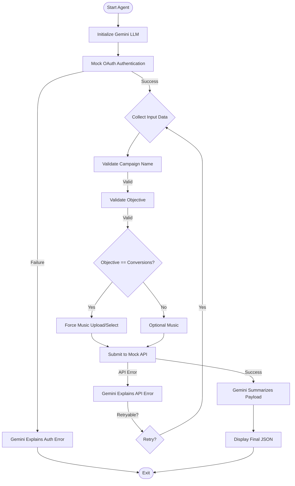

# TikTok Ads AI Agent 🤖

An intelligent, CLI-based agent designed to streamline the creation of TikTok Ad campaigns using Google Gemini AI for expert guidance and error handling.

## 🌟 Features

- **Intelligent Error Handling**: Uses Google Gemini Pro to translate complex OAuth and API errors into human-readable advice and actionable steps.
- **Rule-Based Validation**: Enforces TikTok business rules (e.g., character limits, mandatory music for Conversions) before submission.
- **Mock Integration**: Fully simulated TikTok Ads API and OAuth2 flow for risk-free testing and development.
- **Interactive CLI**: A user-friendly command-line interface with real-time feedback.
- **Expert Persona**: The agent adopts specific personas (OAuth Expert, Ads Expert) depending on the context of the interaction.

## 🛠️ Tech Stack

- **Python 3.10+**
- **Google Generative AI SDK**: Powering the intelligence layer with Gemini 1.5 Flash.
- **Pydantic/Schema Validation**: For robust internal data integrity.
- **Dotenv**: For secure environment variable management.

## 🧩 Technical Deep Dive

### 🔐 How OAuth is Handled
The agent implements a **Mock OAuth2 flow** managed in `oauth.py`. 
- **Validation**: It checks for mandatory environment variables (`TIKTOK_CLIENT_ID`, `TIKTOK_CLIENT_SECRET`).
- **Token Generation**: Successfully authenticated users (using `test_client_id`) receive a structured mock token containing their name and scope information.
- **State Management**: Tokens are stored in an in-memory `_TOKEN_STORE` with support for:
  - **Expiry**: Tokens expire after 5 minutes to test refresh/re-auth logic.
  - **Scopes**: Specifically checks for the `ads` scope required for campaign creation.
  - **Revocation**: Supports manual token revocation to simulate logout or permission removal.

### 🧠 Prompt Design
The intelligence layer in `llm.py` uses a **Decoupled Prompt Strategy**:
- **System Instructions**: Define a high-level expert persona (e.g., "You are an OAuth expert"). This is passed via the `system_instruction` parameter in the Gemini SDK to maintain consistent behavior.
- **Dynamic Context**: The user prompt is injected with raw JSON errors or system state.
- **Instructional Anchors**: Every prompt includes a specific command (e.g., "Explain this error clearly and suggest a fix") to ensure the output remains actionable and concise, avoiding generic LLM conversational "fluff".

### 🔌 API Assumptions & Mocks
The `tiktok_api.py` module simulates the TikTok Marketing API behaviors:
- **Status Codes**: Mimics HTTP status returns like `403 Geo-restriction` and `400 Invalid Argument`.
- **Validation Logic**: Implements business rules that aren't possible to check via simple schema alone, such as the `music_id` requirement for `Conversions` objectives.
- **Scenario Simulation**: Certain triggers are hardcoded for testing, such as campaign names starting with "India" triggering a regional block.

## 🚀 How to Run the Agent

### Step 1: Configure Environment
Create a `.env` file:
```text
GOOGLE_API_KEY=your_key
TIKTOK_CLIENT_ID=test_client_id
TIKTOK_CLIENT_SECRET=test_client_secret
```

### Step 2: Launch
```bash
python agent.py
```

## 📊 Logical Workflow



## 🧪 Testing Scenarios

Try these inputs to see the AI agent in action:
- **Validation**: Enter a 1-character campaign name to trigger local validation.
- **Geo-Block**: Name your campaign "India Promo" to see the AI explain a simulated regional restriction.
- **Music Requirement**: Choose "Conversions" and try to skip music to see the business rule enforcement.

